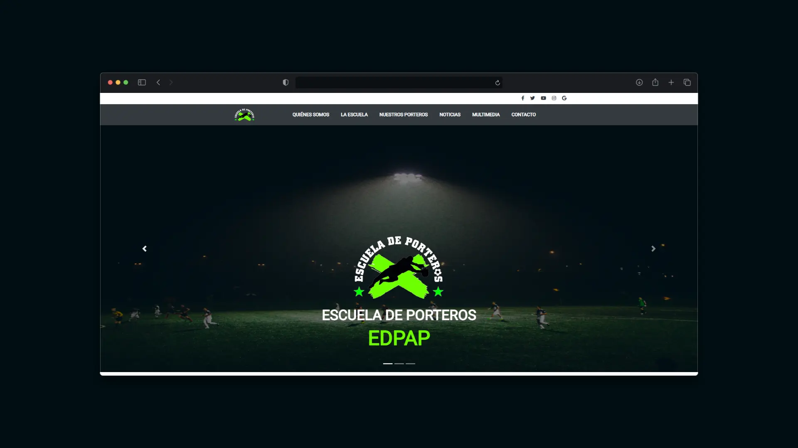
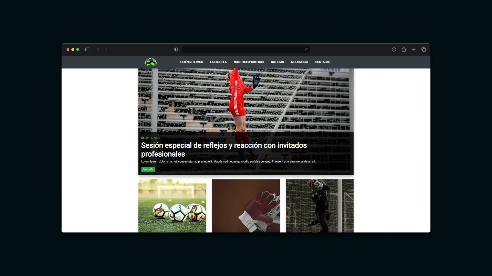
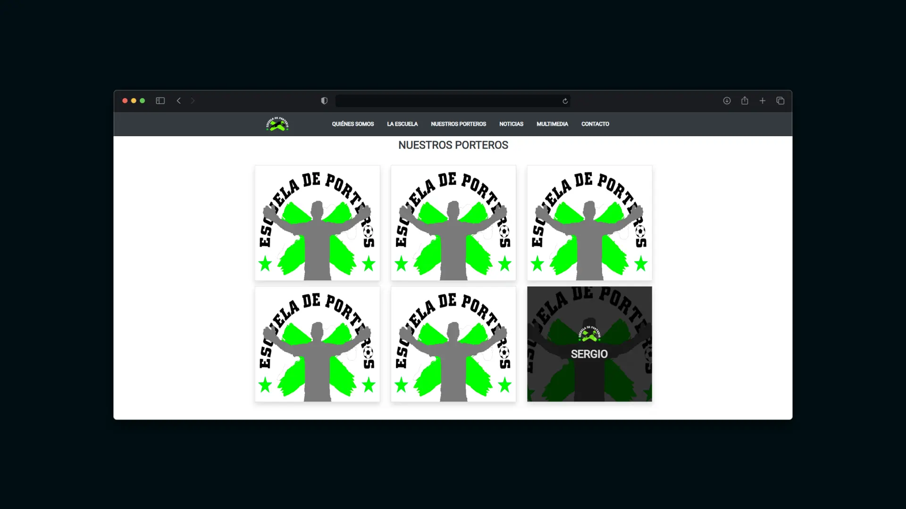
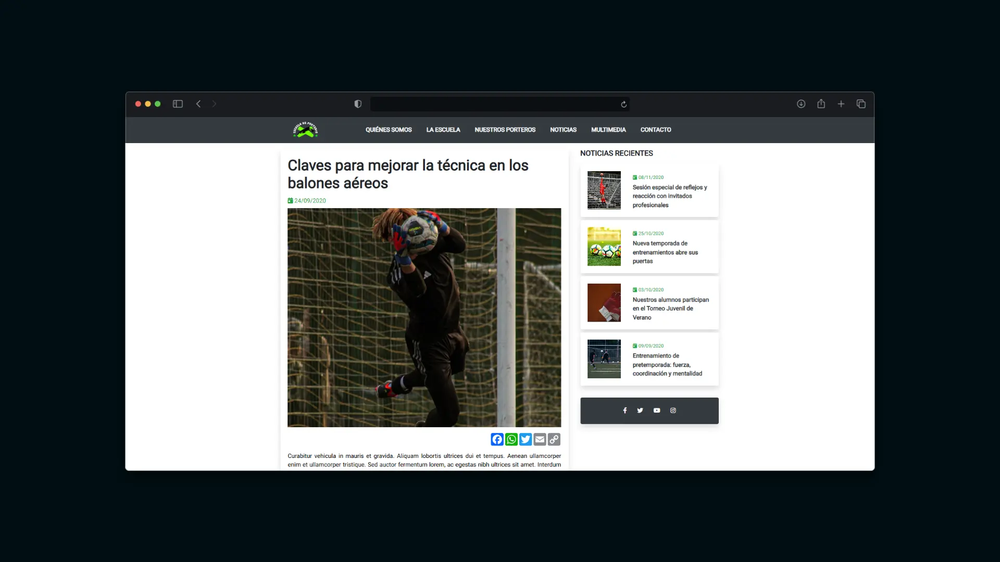
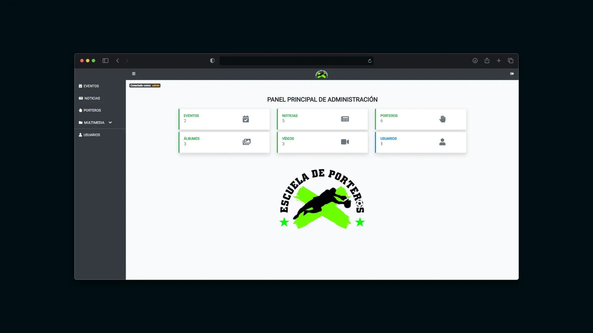
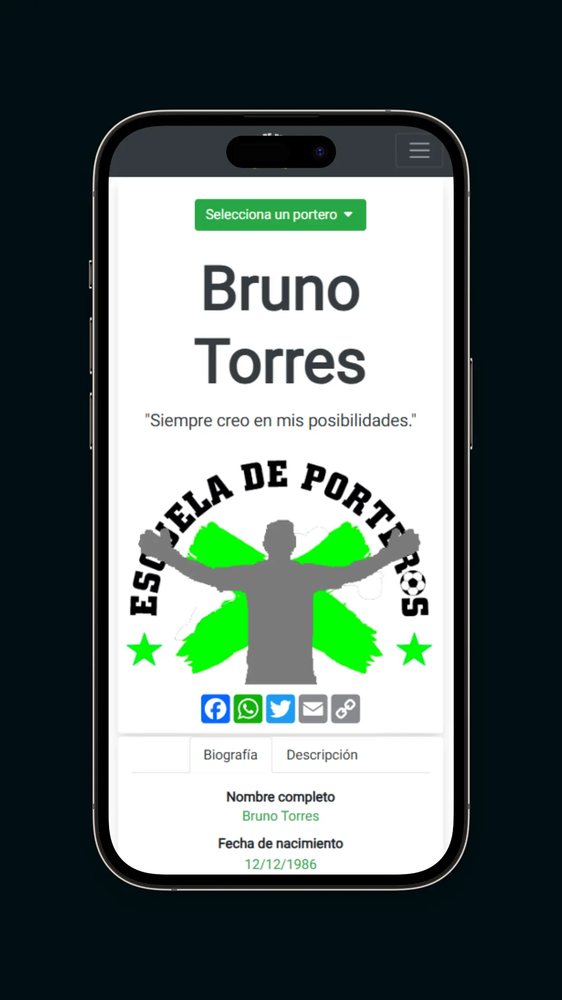
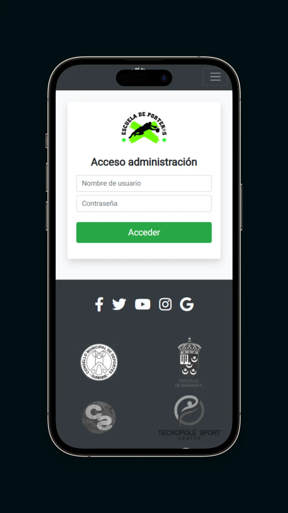
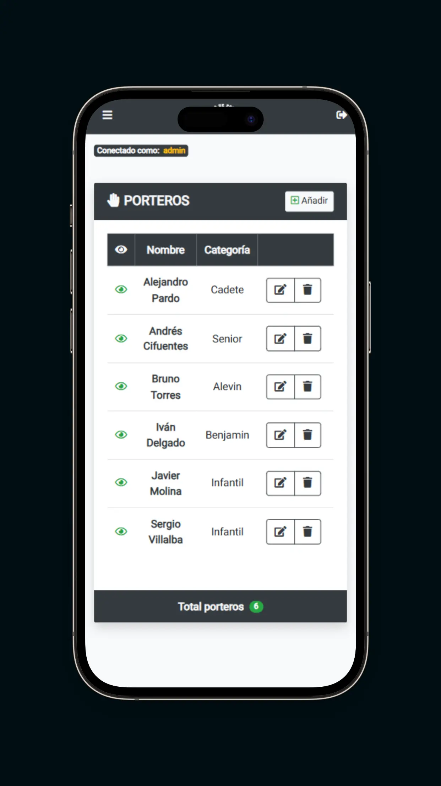

# Proyecto web – Escuela de Porteros EDPAP

Este proyecto es una **plataforma web completa** desarrollada con **CakePHP y Bootstrap**, orientada a la gestión de contenidos de una escuela de porteros de fútbol.  

La aplicación combina:  
- **Parte pública:** sitio informativo para mostrar porteros, noticias, eventos, galería multimedia y datos generales de la escuela.  
- **Parte privada:** panel de administración para gestionar usuarios, contenidos y multimedia de forma segura e intuitiva.  

## 🚀 Características técnicas

- 🔐 Sistema de login y autenticación de usuarios
- 🧩 Arquitectura **MVC** implementada con **CakePHP**  
- 🌈 Interfaz moderna e interactiva con **Bootstrap, jQuery y JavaScript**  
- 📊 Base de datos **MariaDB** integrada mediante el ORM de CakePHP
- 💾 Diseño responsive y adaptado a diferentes dispositivos

## 🚀 Tecnologías utilizadas

- **Backend / Framework:** CakePHP 3.8, PHP 7.4.33  
- **Frontend:** Bootstrap 4.5.2, jQuery 3.5.1, JavaScript, HTML, CSS  
- **Base de datos:** MariaDB 10.4.27 (ORM de CakePHP) 

## ✨ Funcionalidades principales

### 🌍 Parte pública
- **Porteros:** listado completo y ficha individual con información detallada.  
- **Noticias:** listado completo y visualización individual con imágenes y descripción.  
- **Eventos:** listado de eventos con detalle de fecha, lugar y descripción.  
- **Galería multimedia:** álbumes de fotos organizados por año y sección de vídeos tanto informativos como de entrenamientos.  
- **Información general de la escuela:** objetivos y filosofía, metodología y entrenamientos, equipo de trabajo, localización, horarios y tarifas.  

### 🔒 Parte privada (panel de administración)
- Gestión completa (**CRUD**) de: porteros, noticias, eventos, álbumes fotográficos, vídeos y usuarios.  
- Relación entre eventos y noticias para vincular contenidos.  
- Control de visibilidad: opción para mostrar u ocultar contenidos en la parte pública.

## 📸 Capturas (mockups)

Como el proyecto no está desplegado en un entorno público, a continuación se muestran capturas representativas de su diseño y funcionamiento:

### 💻 Versión escritorio
- **Vista pública – Home**  

- **Vista pública – Noticias**  

- **Vista pública – Porteros**  

- **Vista pública – Detalle de noticia**  

- **Panel de administración – Dashboard general**  

- **Panel de administración – Editar noticia**  

### 📱 Versión móvil
- **Vista pública – Home**  

- **Vista pública – Detalle de portero**  

- **Vista pública – Galería fotográfica**  

- **Panel de administración – Login**  

- **Panel de administración - Gestión de porteros**  

## 📌 Estado del proyecto

✔️ Proyecto finalizado como ejemplo de desarrollo web completo.  
🔧 Actualmente se muestran **datos ficticios** para fines de demostración.

## 📝 Notas

El proyecto fue desarrollado como plataforma completa para una escuela de porteros.Aunque la escuela finalmente no llegó a implementarlo,
el desarrollo se completó íntegramente, permitiendo practicar y aplicar tecnologías como **CakePHP, Bootstrap, SQL, HTML, CSS y JavaScript**,
y construir un sistema de gestión de contenidos funcional y responsive.
